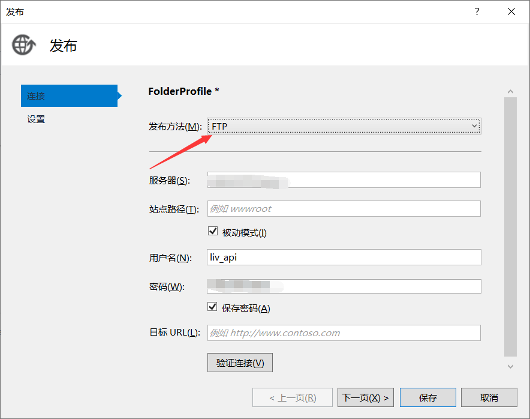
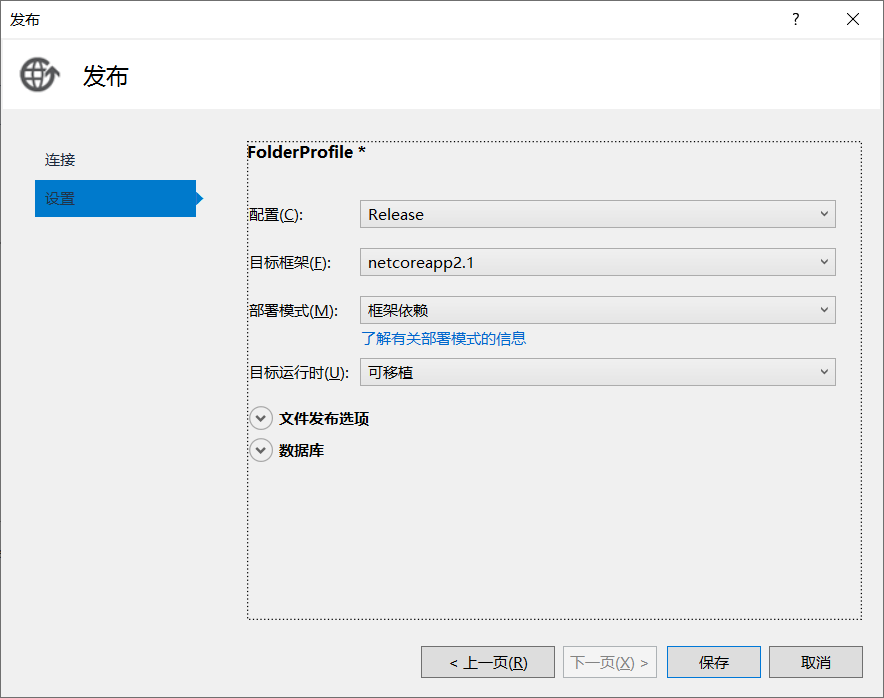
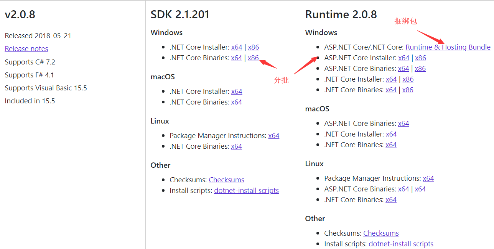

# 随记

#### 一、设置调试显示控制台,不自动启动浏览器
在项目上右击->属性->调试->配置文件选中项目->将启动浏览器勾去掉
![dev][dev]

#### 二、设置调试绑定的Url
在项目上右击->属性->调试->web服务器设置->在文本框输入要绑定的url
![url][url]

#### 三、使用静态文件
一、需要将静态文件(css,js,image)放在wwwroot文件夹下

![wwwroot_dir][wwwroot_dir]

二、需要在``Configure函数``配置
```c#
// 表明使用静态文件
app.UseStaticFiles();
```

三、参考文档:[https://docs.microsoft.com/zh-cn/aspnet/core/fundamentals/static-files?view=aspnetcore-2.2][static_files]


#### 四、请求Web Api出现 No 'Access-Control-Allow-Origin' header is present on the requested resource
一、需要在``Cofnigure函数``配置
```c#
// 表明任何域名都能请求
services.AddCors(options => options.AddPolicy("any",
        builder => builder.AllowAnyMethod().AllowAnyHeader().AllowAnyOrigin().AllowCredentials()));
```
二、在需要开放的**Action**或者是**Controller**中打上特性标签``[EnableCors("any")]``


#### 五、Windows下程序发布与部署
一、在项目上右击->单击**发布**命令


二、在弹出来的发布对话框中**连接选项卡**的**发布方法**选择ftp,然后输入服务器,用户名,密码相关信息



三、在**连接选项卡**选择配置、目标框架、部署模式、目标运行时等信息,最后点击**保存**即可



四、到这一步,如果你之前发布方法选择的是**文件系统**, 你首先需要输入目标位置(即生成的文件保存的路径), 最后将这些生成的文件复制到服务器下的站点目录下

五、注意: 你需要将IIS中站点所使用的应用程序池改为**非托管方式**, 在asp.net core中iis只将请求转发到**http.sys**

六、此时你的程序还是不能运行,你的服务器需要安装.Net Core的环境做为支持, 分为**SDK**和**Runtime**两部分,你可以直接下载捆绑包,捆绑包直接包含这两个程序,也可以一个一个下载安装. **建议用捆绑包**  
[下载地址: https://dotnet.microsoft.com/download/dotnet-core/2.0](https://dotnet.microsoft.com/download/dotnet-core/2.0)


七、安装后重启服务器即可

八、[参考文档: https://docs.microsoft.com/zh-cn/aspnet/core/host-and-deploy/iis/?view=aspnetcore-2.2#install-the-net-core-hosting-bundle](https://docs.microsoft.com/zh-cn/aspnet/core/host-and-deploy/iis/?view=aspnetcore-2.2#install-the-net-core-hosting-bundle)


<!-- 引用链接 -->
[dev]: ./images/2-dev.png
[url]: ./images/2-url.png
[route_attr]: ./images/2-route-attr.png
[wwwroot_dir]: ./images/3-dir.png
[static_files]: https://docs.microsoft.com/zh-cn/aspnet/core/fundamentals/static-files?view=aspnetcore-2.2