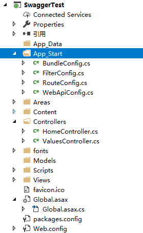
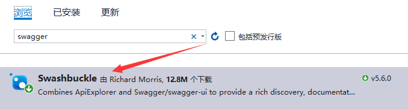
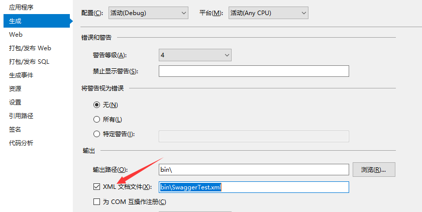

### swagger一分钟入门使用
一、创建swagger测试项目,这里选择使用**ASP.NET Web Api** 生成的项目结构如下:



二、使用Nuget包管器安装***swashbuckle***




三、安装成功之后,会在你的项目中生成一个**SwaggerConfig.cs**的类,这里是Swagger配置的地方
```c#
// 配置文档的版本
c.SingleApiVersion("v1", "SwaggerTest");

// 给文档添加注释,从空个xml文档中读取注释信息
 c.IncludeXmlComments(string.Format("{0}/bin/WebAPI.xml", System.AppDomain.CurrentDomain.BaseDirectory));

 // 防止方法重载报错
c.ResolveConflictingActions(apiDescriptions => apiDescriptions.First());
```


四、在项目上右击->属性->生成->把xml文档文件勾选上




五、配置完成之后运行查看swagger提供的在线地址即可

http://domain/swagger/ui/index#/


